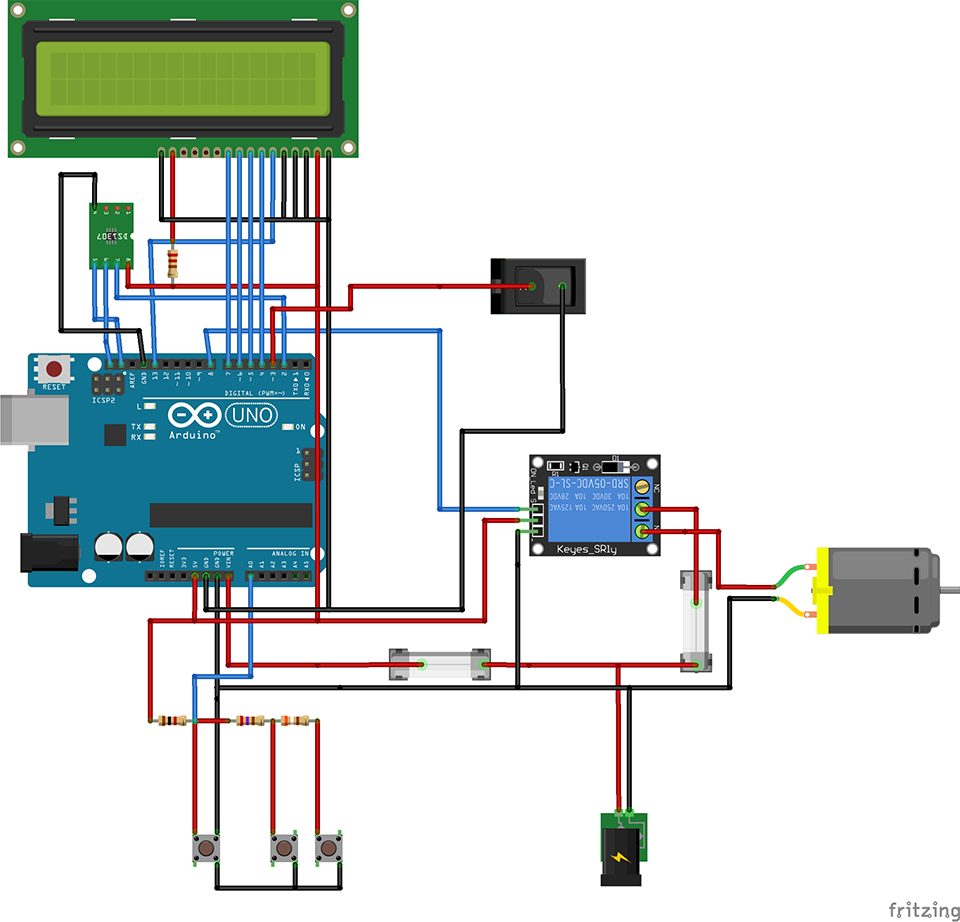

Arduino Plant Watering
======================

# Hardware

* [12V relay module](http://www.kjell.com/se/sortiment/el/elektronik/arduino/moduler/relamodul-for-arduino-p87878)
* [Water hose](http://www.biltema.no/no/Bil---MC/Bilreservedeler/Viskerutstyr/Spylerpumpe/Spylerpumpe-ovrig/Spylerslange-5-m-2000031910/)
* [Windshield washer pump](http://www.biltema.no/no/Bil---MC/Bilreservedeler/Viskerutstyr/Spylerpumpe/Spylerpumpe/Vindusspylerpumpe-universal-2000017965/)
* [12V power supply](http://www.biltema.no/no/Kontor---Teknikk/Batteri-og-Stromforsyning/Nettaggregat-og-ladere/Nettadapter-2000022525/)

## Additional

* Resistors
* Wires
* LEDs
* A switch button
* Free time.
